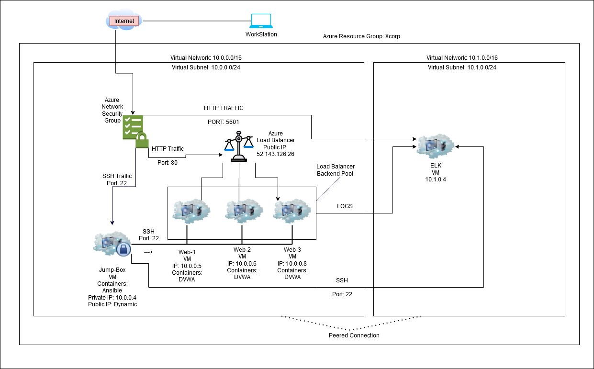

## Automated ELK Stack Deployment
The files in this repository were used to configure the network depicted below.

These files have been tested and used to generate a live ELK deployment on Azure. They can be used to either recreate the entire deployment pictured above. Alternatively, select portions of the ansible.cfg file may be used to install only certain pieces of it, such as Filebeat.

  /etc/ansible/roles: Enter the playbook file._
This document contains the following details:
- Description of the Topologu
- Access Policies
- ELK Configuration
  - Beats in Use
  - Machines Being Monitored
- How to Use the Ansible Build

### Description of the Topology

The main purpose of this network is to expose a load-balanced and monitored instance of DVWA, the D*mn Vulnerable Web Application.

Load balancing ensures that the application will be highly efficient, in addition to restricting unwanted access to the network.
- _TODO: What aspect of security do load balancers protect? A load balancer can be a great addition to any network hosting services because it can mask the actual IP’s and identities of the servers behind the public IP of the load balancer. They also help mitigate against small DOS attacks. What is the advantage of a jump box?_

Integrating an ELK server allows users to easily monitor the vulnerable VMs for changes to the file system and system resources.
- _TODO: What does Filebeat watch for?_ File beat allows the logging of changes to the local system files.
- _TODO: What does Metricbeat record?_ Metric beat allows the administrator to keep track of CPU/RAM usage 

The configuration details of each machine may be found below.
_Note: Use the [Markdown Table Generator](http://www.tablesgenerator.com/markdown_tables) to add/remove values from the table_.

| Name     | Function | IP Address | Operating System |
|----------|----------|------------|------------------|
| Jump Box | Gateway  | 10.0.0.4   | Linux            |
| Web-1    |Webserver | 10.0.0.5   | Linux            |
| Web-2    |Webserver | 10.0.0.6   | Linux            |
| Web-3    |Webserver | 10.0.0.7   | Linux            |
|ELKServer |Monitoring| 10.1.0.4   | Linux            |
### Access Policies

The machines on the internal network are not exposed to the public Internet. 

Only the Jump Box machine can accept connections from the Internet. Access to this machine is only allowed from the following IP addresses:
-47.38.163.252

Machines within the network can only be accessed by Each other.
 Which machine did you allow to access your ELK VM? What was its IP address?_ Elk machine or Kibana GUI can only be accessed by 47.38.163.252 and VM’s on the Virtual Network’s 10.0.0.0/16 and 10.1.0.0/16

A summary of the access policies in place can be found in the table below.

| Name     | Publicly Accessible | Allowed IP Addresses |
|----------|---------------------|----------------------|
| Jump Box | Yes                 | 104.43.224.150       |
| ELK      | No                  | 13.68.146.27         |
| Web-1    | No                  | 40.122.68.129        |
| Web-2    | No                  | 40.122.68.129        |
| Web-3    | No                  | 40.122.68.129        |     

### Elk Configuration

Ansible was used to automate configuration of the ELK machine. No configuration was performed manually, which is advantageous because this made deployment faster and more efficient.
- _TODO: What is the main advantage of automating configuration with Ansible?_ It makes new servers on the network simple to setup

The playbook implements the following tasks:
- Elk can be Installed in 5 steps, starting by downloading and installing Docker.
- Secondly you would want to install python-pip3 and the pip docker module.
- You must also increase the size of the vm.max_map_count variable to  ‘262144’#sysctl -w vm.max_map_count=262144
- Install ELK inside a docker container.
- Ensure that docker and ELK start with system boot-up process.

The following screenshot displays the result of running `docker ps` after successfully configuring the ELK instance.

 
### Target Machines & Beats
This ELK server is configured to monitor the following machines:
-	10.0.0.5(Web-1)
-	10.0.0.6(Web-2)
-	10.0.0.7(Web-3)

We have installed the following Beats on these machines:
-	Web-1:Filebeat & Metricbeat
-	Web-2:Filebeat & Metricbeat
-	Web-3:Filebeat & Metricbeat

These Beats allow us to collect the following information from each machine:
-	Filebeat monitors specified log files for changes or events. Metricbeat monitors the systems for system statistics like CPU usage and memory usage. When setup properly these beat will display data to their respective Kibana dashboards and will allow easy administration of the Web VMs from both security and performance standpoints.

 Using the Playbook
In order to use the playbook, you will need to have an Ansible control node already configured. Assuming you have such a control node provisioned: 

SSH into the control node and follow the steps below:
- Copy the install-elk.yml file to /etc/ansible/.
- Update the hosts file(in /etc/ansible/)to include the internal IP address of the elk machine under the header[elk]. 

- Run the playbook(ansible-playbook install-elk.yml)and navigate to the public IP of the Elk-VM in a web browser to check that the installation worked as expected. Be sure to include the port(:5601) and following text(“/app/kibana”): it should look like this:http://[Elk-VM-Public-IP]:5601/app/kibana or in the context of the network: https://20.127.102.219:5601/app/kibana.

 

_TODO: Answer the following questions to fill in the blanks:_
 Filebeat-config.yml and metricbeat-config.yml Which file is the playbook? Where do you copy it?_ /etc/ansible/files/ directory
- _Which file do you update to make Ansible run the playbook on a specific machine? install-filebeat.yml and install-metricbeat.yml How do I specify which machine to install the ELK server on versus which to install Filebeat on?_ update the Hosts file /etc/ansible/ to include the internal IP of your Web-VMs under heading [webservers]:
- _Which URL do you navigate to in order to check that the ELK server is running?  ansible-playbook install-filebeat and metricbeat.yml

_As a **Bonus**, provide the specific commands the user will need to run to download the playbook, update the files, etc._
